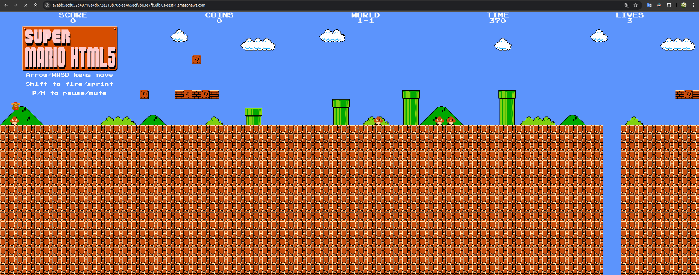

#  Deployment de Aplicação Containerizada em AWS EKS com Terraform

> **Projeto DevOps profissional**: Provisionamento e deployment automatizado de aplicação em Kubernetes usando Infrastructure as Code (IaC) com Terraform e AWS.

---


## 📋 Visão Geral

Este projeto demonstra a implementação de uma arquitetura **Production-Ready** em AWS, cobrindo todo o ciclo de vida da infraestrutura:

- ✅ **Provisionamento de EKS Cluster** via Terraform
- ✅ **Gerenciamento de Identidades e Permissões** (IAM Roles & Policies)
- ✅ **Configuração de Networking** (VPC, Subnets, Security Groups)
- ✅ **Deployment de Aplicação** via Kubernetes Manifests
- ✅ **Remote State Management** com S3 Backend
- ✅ **Customização para ambiente específico** (região, disponibilidade)

### 🎯 Tecnologias Utilizadas

| Tecnologia | Versão | Função |
|-----------|--------|--------|
| **Terraform** | ≥ 1.3.0 | Infrastructure as Code (IaC) |
| **AWS EKS** | Latest | Managed Kubernetes Cluster |
| **Kubernetes** | 1.28+ | Orquestração de containers |
| **Docker** | Latest | Containerização |
| **AWS CLI** | v2 | Gerenciamento da infraestrutura |
| **AWS IAM** | - | Controle de acesso |
| **AWS VPC** | - | Networking |

---

## 🏗️ Arquitetura do Projeto

```
┌──────────────────────────────────────────────────────────────────┐
│                     AWS Account (us-east-1)                      │
├──────────────────────────────────────────────────────────────────┤
│                                                                  │
│  ┌────────────────────────────────────────────────────────────┐  │
│  │                   VPC (Default)                            │  │
│  │                                                            │  │
│  │  ┌─────────────────────────────────────────────────        │  │
│  │  │         EKS Cluster: EKS_CLOUD                 │        │  │
│  │  │                                                │        │  │
│  │  │  ┌─────────────────────────────────────────┐   │        │  │
│  │  │  │    Master Node (AWS Managed)            │   │        │  │
│  │  │  └─────────────────────────────────────────┘   │        │  │
│  │  │                                                │        │  │
│  │  │  ┌─────────────────────────────────────────┐   │        │  │
│  │  │  │  Worker Node 1 (EC2 Instance)           │   │        │  │
│  │  │  │  ┌───────────────────────────────────┐  │   │        │  │
│  │  │  │  │ Pod: mario-deployment             │  │   │        │  │
│  │  │  │  │ └─> Container: Super Mario        │  │   │        │  │
│  │  │  │  └───────────────────────────────────┘  │   │        │  │
│  │  │  └─────────────────────────────────────────┘   │        │  │
│  │  │                                                │        │  │
│  │  │  ┌─────────────────────────────────────────┐   │        │  │
│  │  │  │  Worker Node 2 (EC2 Instance)           │   │        │  │
│  │  │  │  ┌───────────────────────────────────┐  │   │        │  │
│  │  │  │  │ Pod: mario-deployment             │  │   │        │  │
│  │  │  │  │ └─> Container: Super Mario        │  │   │        │  │
│  │  │  │  └───────────────────────────────────┘  │   │        │  │
│  │  │  └─────────────────────────────────────────┘   │        │  │
│  │  │                                                │        │  │
│  │  │  ┌─────────────────────────────────────────┐   │        │  │
│  │  │  │  Service: mario-service                 │   │        │  │
│  │  │  │  (Type: LoadBalancer)                   │   │        │  │
│  │  │  │  └─> AWS NLB (Port: 8080)               │   │        │  │
│  │  │  └─────────────────────────────────────────┘   │        │  │
│  │  └────────────────────────────────────────────────┘        │  │
│  │                                                            │  │
│  │  Public Subnets: us-east-1a, 1b, 1c                        │  │
│  └────────────────────────────────────────────────────────────┘  │
│                                                                  │
│  ┌────────────────────────────────────────────────────────────┐  │
│  │       S3 Backend (Terraform State)                         │  │
│  │       └─> terraform.tfstate (encrypted)                    │  │
│  └────────────────────────────────────────────────────────────┘  │
│                                                                  │
└──────────────────────────────────────────────────────────────────┘
```

---

## 📁 Estrutura do Projeto

```
Deployment-of-super-Mario-on-Kubernetes-using-terraform/
│
├── EKS-TF/                          # Configurações Terraform
│   ├── main.tf                      # Recursos principais (EKS, IAM, Node Groups)
│   ├── provider.tf                  # Configuração do provedor AWS
│   ├── backend.tf                   # Configuração S3 backend (Terraform State)
│   │
│   ├── deployment.yaml              # Kubernetes Deployment manifesto
│   ├── service.yaml                 # Kubernetes Service manifesto
│   │
│   ├── terraform.tfstate            # Estado atual da infraestrutura
│   ├── .terraform.lock.hcl          # Lock file das dependências
│   └── .terraform/                  # Cache de providers e modules
│
├
├── README_PROFISSIONAL.md           # Este arquivo (documentação detalhada)
├── CUSTOMIZACOES.md                 # Log das customizações realizadas
│
```

---

## 🔧 Pré-requisitos

### Softwares Obrigatórios

```bash
# 1. Terraform
terraform --version
# Output: Terraform v1.7.x

# 2. AWS CLI
aws --version
# Output: aws-cli/2.x.x

# 3. kubectl
kubectl version --client
# Output: Client Version: v1.28.x

# 4. Docker
docker --version
# Output: Docker version 25.x.x

# 5. Git
git --version
# Output: git version 2.x.x
```

### Configuração AWS

```bash
# Configure suas credenciais AWS
aws configure
# Você será solicitado para:
# - AWS Access Key ID: [sua-key]
# - AWS Secret Access Key: [sua-secret]
# - Default region: us-east-1
# - Default output format: json

# Verifique a conexão
aws sts get-caller-identity
```

### Permissões IAM Necessárias

Sua conta AWS precisa ter as seguintes permissões:
- `eks:*` - Amazon EKS
- `ec2:*` - EC2 para worker nodes
- `iam:*` - IAM roles e policies
- `s3:*` - S3 para backend (state)
- `elasticloadbalancing:*` - Load Balancer

---

## Guia de Instalação e Deployment

### 1️⃣ Clonar o Repositório

```bash
git clone https://github.com/seu-usuario/Deployment-of-super-Mario-on-Kubernetes-using-terraform.git
cd Deployment-of-super-Mario-on-Kubernetes-using-terraform/EKS-TF
```

### 2️⃣ Inicializar Terraform

```bash
# Inicialize o Terraform e download dos providers
terraform init

# Valide a configuração
terraform validate

# Visualize o plano de execução
terraform plan -out=tfplan
```

**Output esperado**: Lista de recursos que serão criados (EKS Cluster, Node Groups, IAM Roles, etc.)

### 3️⃣ Aplicar Configuração (Criar Infraestrutura)

```bash
# Crie a infraestrutura na AWS
terraform apply tfplan

# Isto irá:
# ✅ Criar EKS Cluster
# ✅ Criar Node Groups (worker nodes)
# ✅ Configurar IAM Roles e Policies
# ✅ Criar VPC e Subnets
# ✅ Armazenar estado no S3
```

⏱️ **Tempo esperado**: 10-15 minutos

### 4️⃣ Configurar kubeconfig

```bash
# Atualize o kubeconfig para acessar o cluster
aws eks update-kubeconfig --name EKS_CLOUD --region us-east-1

# Verifique a conexão com o cluster
kubectl cluster-info
kubectl get nodes

# Output esperado:
# NAME                          STATUS   ROLES    AGE
# ip-172-31-xx-xx.ec2.internal  Ready    <none>   2m
# ip-172-31-xx-xx.ec2.internal  Ready    <none>   2m
```

### 5️⃣ Deploy da Aplicação

```bash
# Aplique os manifestos Kubernetes
kubectl apply -f deployment.yaml
kubectl apply -f service.yaml

# Verifique o deployment
kubectl get deployments
kubectl get pods
kubectl get services

# Output esperado:
# NAME                          READY   STATUS    RESTARTS
# mario-deployment-xxxxx        1/1     Running   0
# mario-deployment-yyyyy        1/1     Running   0
```

### 6️⃣ Acessar a Aplicação

```bash
# Obtenha a URL do LoadBalancer
kubectl describe service mario-service

# Procure por "LoadBalancer Ingress:"
# Exemplo: a1234567890-1234567890.us-east-1.elb.amazonaws.com

# Acesse no navegador ou curl:
curl http://<LOAD_BALANCER_URL>:80
```

---

## 🔄 Customizações Realizadas

### 📌 Alteração de Região

**Original**: `ap-south-1` (Mumbai)  
**Customizado para**: `us-east-1` (N. Virginia)

**Arquivo modificado**: `provider.tf`
```hcl
provider "aws" {
  region = "us-east-1"  # ← Alterado de ap-south-1
  
  default_tags {
    tags = {
      Project     = "Super Mario EKS Deployment"
      Environment = "Production"
    }
  }
}
```

### 🌐 Configuração de Subnets

**Arquivo modificado**: `main.tf`

Configuração de múltiplas zonas de disponibilidade:
```hcl
filter {
  name   = "availability-zone"
  values = [
    "us-east-1a",  # Virginia (AZ-1)
    "us-east-1b",  # Virginia (AZ-2)
    "us-east-1c",  # Virginia (AZ-3)
  ]
}
```

**Benefícios**:
- ✅ Alta disponibilidade
- ✅ Distribuição de carga entre zonas
- ✅ Resilência contra falhas de zona

### 🔐 IAM Roles e Policies

O projeto implementa segurança através de:

1. **IAM Role para EKS Cluster**
   ```hcl
   resource "aws_iam_role" "eks_cluster_role" {
     name = "eks-cluster-cloud"
     # Anexada: AmazonEKSClusterPolicy
   }
   ```

2. **IAM Role para Worker Nodes**
   ```hcl
   resource "aws_iam_role" "eks_node_group_role" {
     name = "eks-node-group-cloud"
     # Anexadas:
     # - AmazonEKSWorkerNodePolicy
     # - AmazonEKS_CNI_Policy
     # - AmazonEC2ContainerRegistryReadOnly
   }
   ```

---

##  Troubleshooting

### ❌ Erro: `InvalidParameterException` ao criar EKS Cluster

**Causa**: Região inválida ou subnets incorretas

**Solução**:
```bash
# Verifique a região
cat provider.tf | grep region

# Verifique as subnets disponíveis
aws ec2 describe-subnets --region us-east-1 --query 'Subnets[*].{ID:SubnetId,Zone:AvailabilityZone}'

# Atualize o main.tf com IDs corretos
```

### ❌ Erro: `InvalidRole.NotFound`

**Causa**: IAM Role não foi criada corretamente

**Solução**:
```bash
# Verifique as roles criadas
aws iam list-roles | grep eks

# Se necessário, destrua e recrie
terraform destroy
terraform apply
```

### ❌ Pods ficam em `Pending`

**Causa**: Worker nodes não estão prontos

**Solução**:
```bash
# Verifique o status dos nodes
kubectl get nodes -o wide

# Verifique os logs do node
kubectl describe node <node-name>

# Se necessário, aguarde 5-10 minutos para boot completo
```

### ❌ `kubectl` não consegue conectar ao cluster

**Causa**: kubeconfig desatualizado ou credenciais incorretas

**Solução**:
```bash
# Reconfigure o kubeconfig
aws eks update-kubeconfig --name EKS_CLOUD --region us-east-1

# Verifique o arquivo
cat ~/.kube/config | grep EKS_CLOUD

# Teste a conexão
kubectl get nodes
```

---

##  Gerenciamento do Estado Terraform

### 📍 Remote State com S3

O projeto utiliza S3 para armazenar o estado remotamente (como especificado em `backend.tf`):

```hcl
terraform {
  backend "s3" {
    bucket         = "seu-bucket-terraform"
    key            = "eks/terraform.tfstate"
    region         = "us-east-1"
    encrypt        = true
    dynamodb_table = "terraform-locks"
  }
}
```

**Benefícios**:
- ✅ Colaboração em equipe (compartilhar estado)
- ✅ Segurança (estado criptografado)
- ✅ Versionamento (histórico de mudanças)
- ✅ Backup automático

###  Comandos de Estado

```bash
# Listar todos os recursos gerenciados
terraform state list

# Verificar estado específico
terraform state show aws_eks_cluster.eks_cluster

# Backup do estado local
terraform state pull > backup-$(date +%Y%m%d-%H%M%S).tfstate

# Restaurar estado
terraform state push backup-20240104-123456.tfstate
```

---


---

## 🧹 Limpeza (Destruição da Infraestrutura)

⚠️ **Aviso**: Isto é **irreversível**. Todos os recursos AWS serão deletados.

```bash
# Remova os recursos Kubernetes primeiro
kubectl delete deployment mario-deployment
kubectl delete service mario-service

# Destrua a infraestrutura AWS
terraform destroy

# Confirme digitando: yes

# Verifique se tudo foi deletado
aws eks list-clusters --region us-east-1
```

---

## 💰 Estimativa de Custos

| Recurso | Estimativa Mensal | Notas |
|---------|------------------|-------|
| EKS Cluster | $73 | Gerenciado pela AWS |
| 2x EC2 t3.medium | $60 | Worker nodes |
| Network Load Balancer | $16 | Service type LoadBalancer |
| Data Transfer | $5 | Tráfego de entrada/saída |
| **Total Aproximado** | **~$154** | Dependente de uso real |

💡 **Dica**: Use spot instances para reduzir custos em desenvolvimento

---

##  Recursos e Referências

### Documentação Oficial
- [AWS EKS Documentation](https://docs.aws.amazon.com/eks/)
- [Terraform AWS Provider](https://registry.terraform.io/providers/hashicorp/aws/latest)
- [Kubernetes Official Docs](https://kubernetes.io/docs/)

### Terraform Best Practices
- [Terraform Style Guide](https://developer.hashicorp.com/terraform/language/style)
- [AWS Well-Architected Framework](https://aws.amazon.com/architecture/well-architected/)

### Cursos e Artigos
- [Terraform for AWS](https://learn.hashicorp.com/collections/terraform/aws)
- [EKS Best Practices Guide](https://aws.github.io/aws-eks-best-practices/)

---

## 🎓 Lições Aprendidas

### ✅ O que funcionou bem

1. **Terraform para IaC**: Declarativo, versionável, reutilizável
2. **EKS Gerenciado**: Reduz overhead de manutenção do control plane
3. **IAM Granular**: Princípio do menor privilégio para segurança
4. **Multi-AZ**: Alta disponibilidade built-in

### 📌 Pontos de Atenção

1. **Custo**: Monitorar regularmente para evitar surpresas
2. **Atualizações**: Planejar atualizações de cluster com antecedência
3. **Backup**: Estado Terraform e dados de aplicação precisam de backup
4. **Scaling**: Configurar autoscaling para lidar com picos de demanda


---

## 👤 Autor

**Samira**  
 DevOps | Terraform | Kubernetes | AWS

---

## 📄 Licença

Este projeto é fornecido como é, para fins educacionais e profissionais.

---

## 🤝 Contribuições

Sugestões e melhorias são bem-vindas! Abra uma issue ou pull request.

---

## 🎮 Aplicação em Produção

### Super Mario Rodando no Kubernetes


*Super Mario game rodando através do LoadBalancer do EKS*


---

**Última atualização**: 4 de Janeiro de 2026  
**Versão**: 1.0
